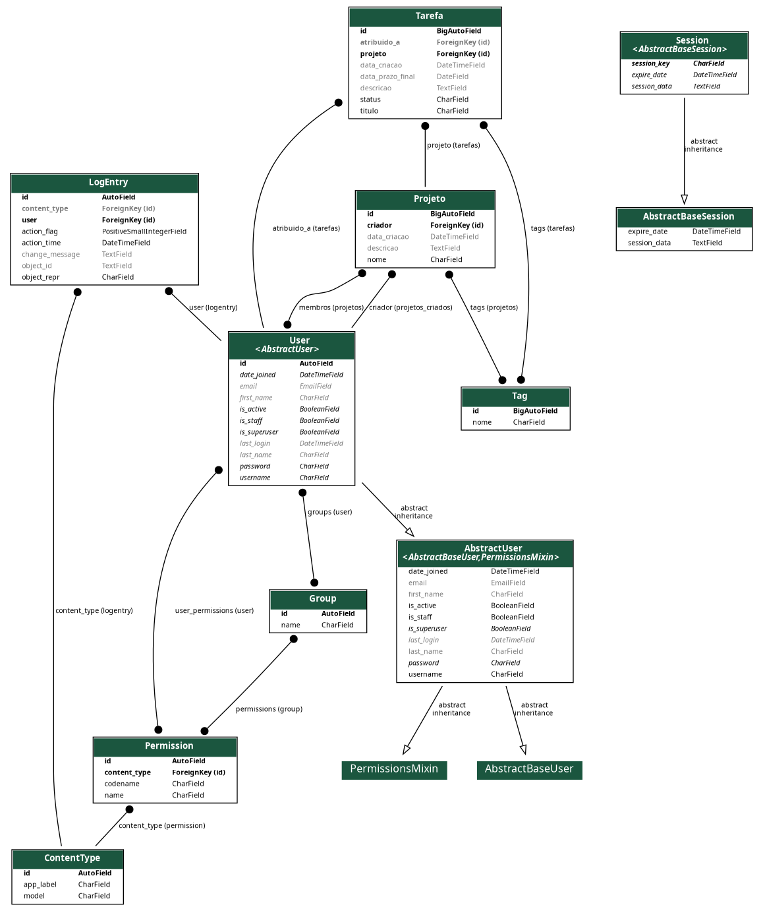

# Sistema de Gestão de Tarefas

**Trabalho da disciplina Programação Web - GAC116**

**Integrantes:**
- Lislaila Tarsila Pereira
- Lucas Malachias Furtado
- Luiz Filipe Bartelega Penha

**Universidade Federal de Lavras**

## Descrição do projeto

Este projeto é um sistema web de Gestão de Tarefas, desenvolvido como aplicação de aprendizado utilizando o framework Django e o banco de dados SQLite. Ele oferece uma interface simples e eficiente para gerenciar tarefas do dia a dia, sejam pessoais ou profissionais.

## Estrutura dos Modelos

Abaixo está a representação gráfica da estrutura dos modelos do projeto:

## Tecnologias Utilizadas

- Django: Framework Python para desenvolvimento web.
- SQLite: Banco de dados relacional leve e integrado.

---
